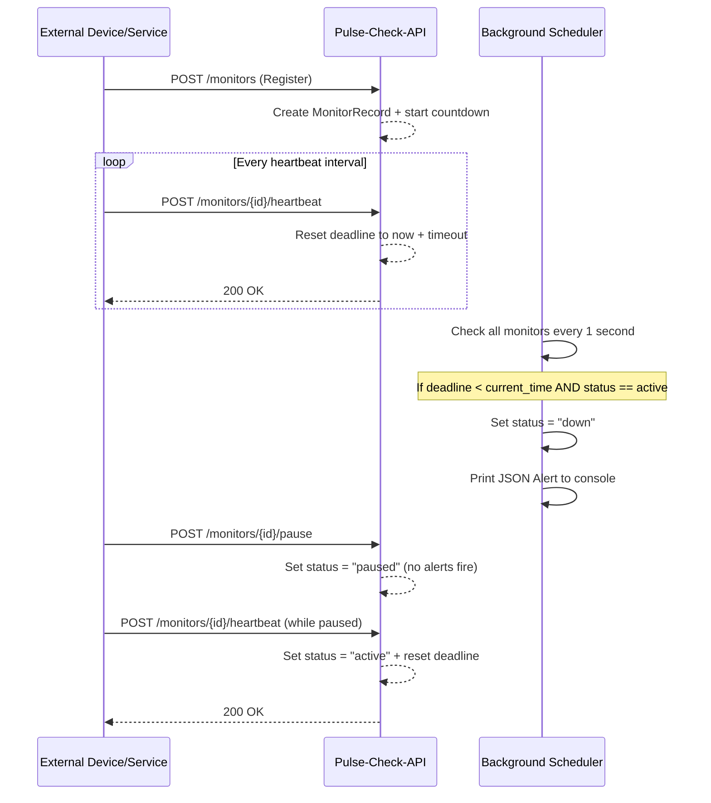
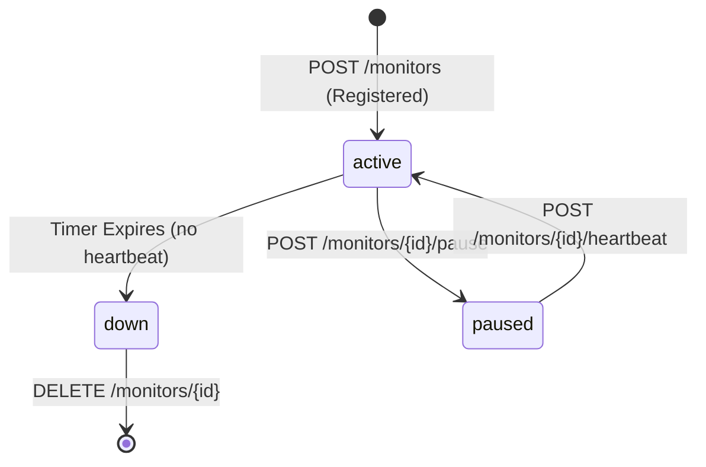

#  Pulse-Check-API — "Watchdog" Sentinel

> A Dead Man's Switch API for monitoring remote devices in critical infrastructure environments.

Built for **CritMon Servers Inc.** — a company that monitors remote solar farms and unmanned weather stations in areas with poor connectivity. This system automatically detects when a device goes silent and fires an alert before a human ever has to check a log.

---

##  Author

**TUYISHIME Isaac**
GitHub: [@IsaacPro17](https://github.com/IsaacPro17)

---

## 📑 Table of Contents

- [Overview](#overview)
- [Architecture Diagrams](#architecture-diagrams)
- [Project Structure](#project-structure)
- [Setup Instructions](#setup-instructions)
- [API Documentation](#api-documentation)
- [Developer's Choice Feature](#developers-choice-feature)
- [Pre-Submission Checklist](#pre-submission-checklist)

---

## Overview

Devices register a **monitor** with a countdown timer (e.g., 60 seconds). If the device fails to send a **heartbeat** before the timer expires, the system automatically triggers a JSON alert and marks the device as `down`.

**Tech Stack:**
- **Language:** Python 3.11
- **Framework:** FastAPI
- **Server:** Uvicorn
- **Validation:** Pydantic v2
- **Storage:** In-memory (dict)
- **Scheduling:** Python `threading` (daemon thread, 1s polling)

---

## Architecture Diagrams

### Heartbeat Sequence Flow



### Monitor Lifecycle State Diagram



---

## Project Structure

```
backend/Pulse-Check/
├── app/
│   ├── __init__.py          # Package initializer
│   ├── main.py              # FastAPI app entry point + lifespan
│   ├── models.py            # Pydantic models & MonitorStatus enum
│   ├── monitor_store.py     # In-memory data store (CRUD functions)
│   ├── scheduler.py         # Background watchdog daemon thread
│   └── routes/
│       ├── __init__.py      # Routes package initializer
│       └── monitors.py      # All /monitors API endpoints
├── requirements.txt         # Python dependencies
├── .gitignore               # Git ignore rules
└── README.md                # This file
```

---

## Setup Instructions

### Prerequisites
- [Miniconda or Anaconda](https://docs.conda.io/en/latest/miniconda.html)
- Git
- Python 3.11+

### 1. Clone the Repository

```bash
git clone https://github.com/IsaacPro17/AmaliTech-DEG-Project-based-challenges.git
cd AmaliTech-DEG-Project-based-challenges/backend/Pulse-Check
```

### 2. Create & Activate Conda Environment

```bash
conda create -n watchdog-env python=3.11 -y
conda activate watchdog-env
```

### 3. Install Dependencies

```bash
pip install -r requirements.txt
```

### 4. Start the Server

```bash
uvicorn app.main:app --host 0.0.0.0 --port 8000 --reload
```

### 5. Access the API

| Interface | URL |
|-----------|-----|
| Swagger UI (Interactive Docs) | http://127.0.0.1:8000/docs |
| ReDoc | http://127.0.0.1:8000/redoc |
| Root Health Check | http://127.0.0.1:8000/ |

---

## API Documentation

### Base URL
```
http://127.0.0.1:8000
```

### Monitor Status Values
| Status | Description |
|--------|-------------|
| `active` | Monitor is running and countdown is ticking |
| `paused` | Monitor is paused — no alerts will fire |
| `down` | Timer expired — alert has been fired |

---

### Endpoints

#### `POST /monitors` — Register a Monitor
Creates a new monitor and starts the countdown timer.

**Request Body:**
```json
{
  "id": "device-123",
  "timeout": 60,
  "alert_email": "admin@critmon.com"
}
```

**Response — `201 Created`:**
```json
{
  "id": "device-123",
  "status": "active",
  "timeout": 60,
  "alert_email": "admin@critmon.com",
  "seconds_remaining": 60,
  "created_at": 1777148173.43
}
```

**Error — `400 Bad Request`** (if ID already exists):
```json
{ "detail": "Monitor with this ID already exists." }
```

---

#### `POST /monitors/{id}/heartbeat` — Send a Heartbeat
Resets the countdown timer. Also unpauses a paused monitor.

**Example:**
```bash
POST /monitors/device-123/heartbeat
```

**Response — `200 OK`:**
```json
{
  "id": "device-123",
  "status": "active",
  "timeout": 60,
  "seconds_remaining": 60
}
```

**Error — `404 Not Found`** (monitor doesn't exist):
```json
{ "detail": "Monitor not found." }
```

**Error — `409 Conflict`** (monitor is down):
```json
{ "detail": "Monitor is down and cannot be reset. Please re-register." }
```

---

#### `POST /monitors/{id}/pause` — Pause a Monitor
Stops the countdown completely. No alerts will fire while paused.

**Example:**
```bash
POST /monitors/device-123/pause
```

**Response — `200 OK`:**
```json
{
  "message": "Monitor device-123 has been paused.",
  "status": "paused"
}
```

**Error — `400 Bad Request`** (already paused):
```json
{ "detail": "Monitor is already paused." }
```

**Error — `409 Conflict`** (monitor is down):
```json
{ "detail": "Cannot pause a monitor that is already down." }
```

---

#### `GET /monitors` — List All Monitors
Returns all monitors. Supports optional filtering by status.

**Query Parameter (optional):**
| Parameter | Type | Values |
|-----------|------|--------|
| `status` | string | `active`, `paused`, `down` |

**Examples:**
```bash
GET /monitors                  # returns all monitors
GET /monitors?status=active    # returns only active monitors
GET /monitors?status=paused    # returns only paused monitors
GET /monitors?status=down      # returns only down monitors
```

**Response — `200 OK`:**
```json
[
  {
    "id": "device-123",
    "status": "active",
    "timeout": 60,
    "alert_email": "admin@critmon.com",
    "seconds_remaining": 45,
    "created_at": 1777148173.43
  }
]
```

---

#### `GET /monitors/{id}` — Get a Single Monitor
Returns details for one specific monitor.

**Response — `200 OK`:**
```json
{
  "id": "device-123",
  "status": "active",
  "timeout": 60,
  "alert_email": "admin@critmon.com",
  "seconds_remaining": 32,
  "created_at": 1777148173.43
}
```

**Error — `404 Not Found`:**
```json
{ "detail": "Monitor not found." }
```

---

#### `DELETE /monitors/{id}` — Delete a Monitor
Permanently removes a monitor from the system.

**Response — `200 OK`:**
```json
{ "message": "Monitor device-123 has been deleted." }
```

**Error — `404 Not Found`:**
```json
{ "detail": "Monitor not found." }
```

---

### Alert Behavior
When a monitor's timer expires, the background scheduler prints this to the server console:

```json
{
  "ALERT": "Device device-123 is down!",
  "time": "2026-04-25T23:20:00.123456"
}
```

---

## Developer's Choice Feature

### Feature: Status Filtering on `GET /monitors`

**What it does:**
The `GET /monitors` endpoint accepts an optional `?status=` query parameter that filters the returned list to only monitors matching the given status (`active`, `paused`, or `down`).

**Why I added it:**

In a real-world infrastructure monitoring scenario, an operator managing hundreds of devices doesn't want to scroll through every monitor to find the ones that are down or paused. They need to instantly answer:

- *"Which devices are currently offline?"* → `GET /monitors?status=down`
- *"Which devices are under maintenance right now?"* → `GET /monitors?status=paused`
- *"How many devices are healthy?"* → `GET /monitors?status=active`

Without this feature, the client would have to fetch all monitors and filter them on their side — wasting bandwidth and adding unnecessary complexity to every dashboard or alerting tool built on top of this API.

This is a small addition with a large practical impact, and it follows the RESTful convention of using query parameters for collection filtering.

---

## Pre-Submission Checklist

| # | Item | Status |
|---|------|--------|
| 1 | Repository is set to **Public** | ✅ |
| 2 | No `node_modules`, `.env`, `.DS_Store` in repo | ✅ |
| 3 | `uvicorn app.main:app` starts without crashing | ✅ |
| 4 | Architecture Diagram included in README | ✅ |
| 5 | Original instructions replaced with own documentation | ✅ |
| 6 | API Docs with endpoints and example requests | ✅ |
| 7 | Multiple meaningful git commits | ✅ |
| 8 | Developer's Choice feature implemented and documented | ✅ |
